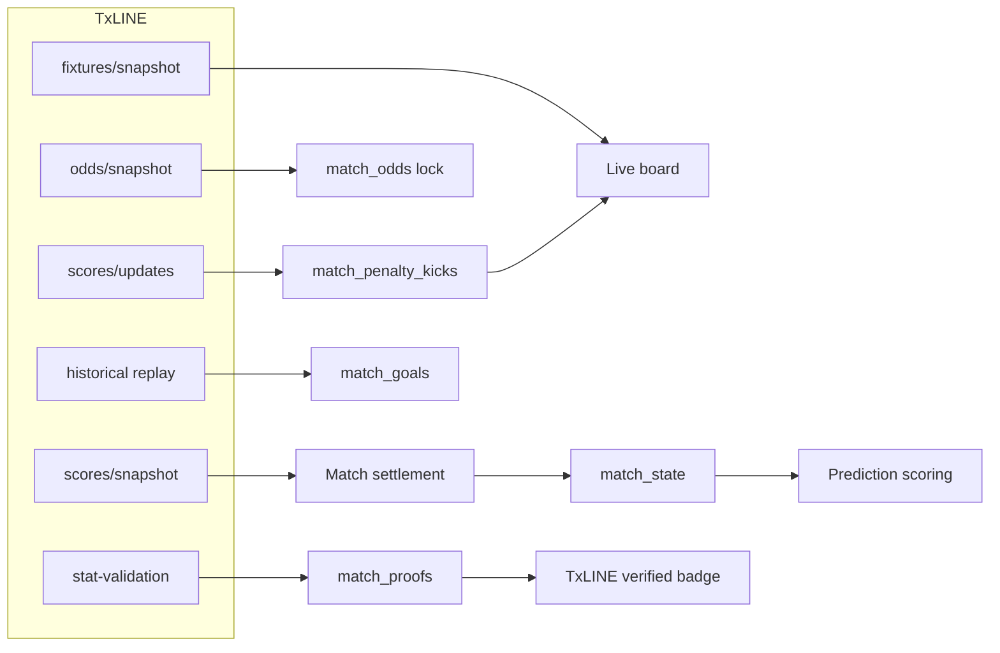

# Copa Mundial


Score-prediction game on X (Twitter): reply with a scoreline before kickoff, earn points from accuracy and market odds, climb a cumulative leaderboard. Daily snapshot at 10:00 UTC locks the top 20 for USDC payout on Solana.

**Live:** [copamundial.app](https://copamundial.app) · **Track:** Superteam × TxODDS — Consumer & Fan Experiences


## Live usage (production)

Queried **2026-07-08** against production Supabase and the public leaderboard API.

| Metric | Value |
|--------|------:|
| Predictions stored | 274 |
| Players with scored points | 107 |
| Matches settled via TxLINE | 8 |
| Dual proofs in `match_proofs` | 8 (all verified badge) |
| Goal rows in `match_goals` | 40 |
| Payout epochs opened (devnet) | 4 |
| Total points awarded | 872 |

Public leaderboard: `GET /api/leaderboard` → **107** ranked players (top score 33 pts as of query date).

## Judge quickstart

```bash
npm install
cp .env.example .env.local   # fill TxLINE, Supabase, Solana keys

# Dual Merkle proof + on-chain validate_stat simulation (devnet)
npx tsx scripts/verify-proof.ts 18202701

# Solana payout loop (devnet only)
npm run demo:epoch -- --pot 2000
npm run e2e:solana-claim -- <epochId>

# Key unit tests
npm run test:ci
```

Example proof output for Argentina vs Egypt (TxFixtureId `18202701`): [`docs/PROOF_DEMO.md`](docs/PROOF_DEMO.md).

## How it works

- Reply to a match thread on X with a scoreline before kickoff — your first valid reply is the one that counts.
- Points from every match add to your season total on the leaderboard.
- A daily snapshot at **10:00 UTC** locks the top 20 and opens on-chain USDC claims.

## Built on TxLINE

[TxLINE](https://txline.txodds.com/documentation/worldcup) (TxOdds) supplies fixtures, live scores, odds, stat-validation proofs, and score-event replay.

**Documentation:** [TxLINE World Cup API](https://txline.txodds.com/documentation/worldcup)

### Auth

1. **Guest JWT** — `POST /auth/guest/start`, refreshed automatically (`lib/txodds.ts`).
2. **API token** — `X-Api-Token` from activation (`txodds/get-txodds-key.mjs` → `TXODDS_API_TOKEN`).

```
Authorization: Bearer <guest jwt>
X-Api-Token:   <activated api token>
```

### TxLINE integration — six surfaces

| # | Endpoint | Role in Copa Mundial |
|---|----------|----------------------|
| 1 | `GET /api/fixtures/snapshot` | Live board schedule + kickoff (`lib/txScheduleBoard.ts`, `lib/syncNewFixturesFromTxline.ts`) |
| 2 | `GET /api/scores/snapshot/{fixtureId}` | Live score, clock, scorers, terminal settlement on **regulation 90+stoppage** (`lib/txMatchSettlement.ts`, `lib/scoreFinishedMatches.ts`) |
| 3 | `GET /api/odds/snapshot/{fixtureId}` | 1X2 implied % → locked to `match_odds` on first board fetch for upset multiplier (`lib/ensureMatchOdds.ts`, `lib/scoring.ts`) |
| 4 | `GET /api/scores/stat-validation` | Dual Merkle proofs per settled match — official `game_finalised` (keys 1,2) + regulation basis (1001,1002,3001,3002) (`lib/matchProofFetch.ts`) |
| 5 | `GET /api/scores/historical/{fixtureId}` | Score replay to backfill `match_goals` when post-FT snapshot trims events (`lib/backfillMatchGoals.ts`) |
| 6 | `GET /api/scores/updates/{fixtureId}` | Full kick-by-kick penalty replay when snapshot drops shootout rows (`lib/penaltyShootout.ts`, `loadScoreEventsForMatch()` in `lib/txMatchSettlement.ts`) |

### TxLINE integration map



### Penalty shootout pipeline

When a knockout match goes to pens, the scores **snapshot** often trims individual kick rows after full time. Copa Mundial merges three feeds:

1. **Snapshot** — live tally and terminal status
2. **Updates** (`/api/scores/updates/{fixtureId}`) — kick-by-kick replay with `PlayerId` on scored pens
3. **Historical** — fallback when updates are empty

Parsed kicks persist to `match_penalty_kicks` and render as ○/× marks under each side on the fixture card (`app/mundial/ui/PenaltyKickMarks.tsx`). UI sandbox: [`/proof-preview`](https://copamundial.app/proof-preview) (verified badge), [`/penalty-preview`](https://copamundial.app/penalty-preview) (shootout marks).

Live goal events accumulate in `match_goals` via the scores feed (`lib/matchGoalsPersist.ts`). Odds locking uses `match_odds`, not goal rows.

### Scoring formula

**Accuracy base** (best tier only — one score per match):

| Tier | Base points |
|------|-------------|
| Exact scoreline | 5 |
| Correct result (win/draw/loss) | 3 |
| Played (wrong result) | 1 |

**Market multiplier** (locked `match_odds` 1X2, only when exact or result is correct):

```
multiplier = min(3, 100 / impliedPct)
points     = round(base × multiplier)
```

Implementation: `lib/scoring.ts`.

### Settlement proofs

After a match settles via TxLINE, the scoring cron fetches stat-validation proofs and stores them in `match_proofs` (`lib/matchProofFetch.ts`). Each row holds two payloads: an **official** proof at the `game_finalised` event (stat keys 1 and 2) and a **regulation** proof at the settlement basis (stat keys 1001, 1002, 3001, 3002). Mundial scores predictions on the regulation total.

Event **seq** selection prefers the `game_finalised` record from the scores feed. If only a terminal whistle proof is available at first fetch, the row is stored with `seq_source=terminal_fallback` and upgraded when the finalised proof arrives (self-healing within 24 hours).

The **TxLINE verified** badge on an FT card is shown only when the regulation proof exactly matches the settled score in `match_state`. Any mismatch suppresses the badge (`evaluateProofSemantics` in `lib/txScoreProofSemantics.ts`).


**On-chain verification** is reproducible via `scripts/verify-proof.ts`: fetches both proofs, then simulates TxOracle `validate_stat` + `equalTo` against the devnet `daily_scores_roots` Merkle root (`lib/txlineValidateStat.ts`, IDL in `txodds/txoracle-devnet.json`). This is a judge/ops CLI path — not triggered from the fan UI at runtime.

## Stack

- Next.js (App Router) + TypeScript
- TxLINE — fixtures, scores, odds, proofs
- Supabase (Postgres) — predictions, `match_odds`, `match_goals`, `match_proofs`, snapshots, payout epochs
- NextAuth (X provider)
- Solana + USDC — signed claim vouchers, operator-opened epochs
- Vercel — crons for kickoff collection, scoring, daily snapshot, fixture sync

## Smart contract

Anchor program in [`solana-program/`](solana-program/). Operator opens each epoch with a USDC pot; server signs per-winner vouchers; `claim` checks ed25519 + keccak message hash on-chain before transfer.

**Devnet program ID:** `2GvW9gBcFmmUcoQDoBVQe9rpR1dGzD4uTdaLzzwRzRz9` (`declare_id!` in `solana-program/programs/state/src/lib.rs`).

### On-chain evidence (devnet)

| Action | Explorer |
|--------|----------|
| **Open epoch** (`OpenEpoch`) | [321wRsoC…AzbyiLo](https://explorer.solana.com/tx/321wRsoCqZno98QZzUiagHjigVfXHKwmBnpe57c6nfEQt5cW6D8dNzQDyjiQ1EYuMc4uRapABtzEonhd7AzbyiLo?cluster=devnet) |
| **USDC claim** (`Claim`) | [3KzPYxmn…BgQd4A](https://explorer.solana.com/tx/3KzPYxmnCebQ2Andavj828RyTwEPEv6dcT5hkxB8cLoTVshmySEyAmhxpNaa3CCnUqqyJyVqmw9u73JeCbBgQd4A?cluster=devnet) |

## Database setup

Apply migrations in order on a fresh Supabase project (Dashboard → SQL Editor), or use helper scripts where noted.

| Order | File | Notes |
|-------|------|-------|
| 1 | `supabase/schema.sql` | Base tables: predictions, match_state, payout_epochs, leaderboard_snapshots |
| 2 | `supabase/migrations/001_txline_tables.sql` | Or `npm run migrate:txline` |
| 3 | `supabase/migrations/20260704000000_match_goals.sql` | Goal accumulation table |
| 4 | `supabase/migrations/20260704153000_lock_rls.sql` | Remove anon write on `predictions` / `match_state` |
| 5 | `supabase/migrations/20260704160000_match_proofs.sql` | Base proof storage |
| 6 | `supabase/migrations/20260704163000_match_proofs_semantics.sql` | Semantics columns |
| 7 | `supabase/migrations/20260704170000_match_proofs_dual.sql` | Official + regulation payloads |
| 8 | `supabase/migrations/20260704224500_match_goals_penalty.sql` | Penalty flag on goal rows |
| 9 | `supabase/migrations/20260707100000_match_state_tx_fixture.sql` | Tx fixture id + fixture sync columns |
| 10 | `supabase/migrations/20260708010000_match_penalty_kicks.sql` | Penalty kick accumulator |

Steps 5–7 can also run via `npx tsx scripts/apply-match-proofs-migrations.ts` when `DATABASE_URL` or `SUPABASE_SERVICE_ROLE_KEY` is set.

Requires `SUPABASE_SERVICE_ROLE_KEY` for app and migration scripts.

## Supabase access model

The browser does not write to Postgres directly.

```
Browser  →  fetch("/api/…")  →  Next.js route / cron  →  getSupabaseAdminClient()  →  Postgres
```

- **Client:** `/api/matches`, `/api/leaderboard`, `/api/me/leaderboard-stats`
- **Server:** collection, scoring, snapshots, claims — `SUPABASE_SERVICE_ROLE_KEY`
- **RLS:** reward tables have no anon/authenticated write policies (step 4 above)

See also [`docs/SUPABASE_RLS.md`](docs/SUPABASE_RLS.md).

## Running locally

```bash
npm install
npm run dev
```

Copy `.env.example` to `.env.local` (X auth, Supabase, `TXODDS_API_TOKEN`, Solana RPC and signer keys). No secrets are committed.

Refresh live usage stats:

```bash
npx tsx scripts/query-live-usage.ts
```

## Devnet payout demo

Requires `SOLANA_RPC_URL` containing `devnet`, operator/signer keys, and a funded rewards vault.

```bash
npm run demo:epoch -- --pot 2000
npm run e2e:solana-claim -- <epochId>
```

`open:solana-epoch` opens an on-chain epoch manually (positional args, no devnet guard).

Goal and proof maintenance:

```bash
npm run backfill:goals
npm run backfill:proof
npx tsx scripts/verify-proof.ts <txFixtureId>
```

## Demo video

[`docs/DEMO_VIDEO_SCRIPT.md`](docs/DEMO_VIDEO_SCRIPT.md) — ~3–4 minute walkthrough.

## License

MIT — see [LICENSE](LICENSE).
