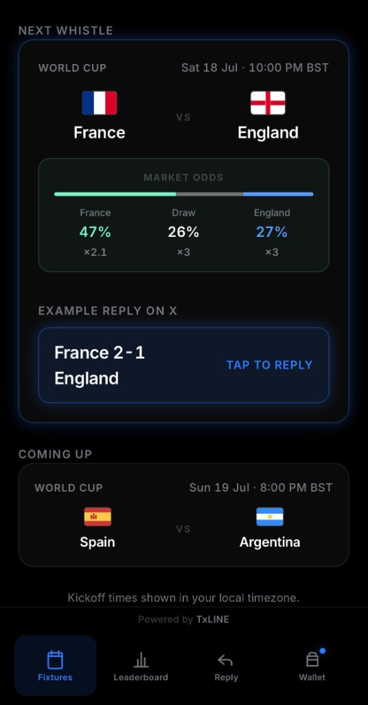
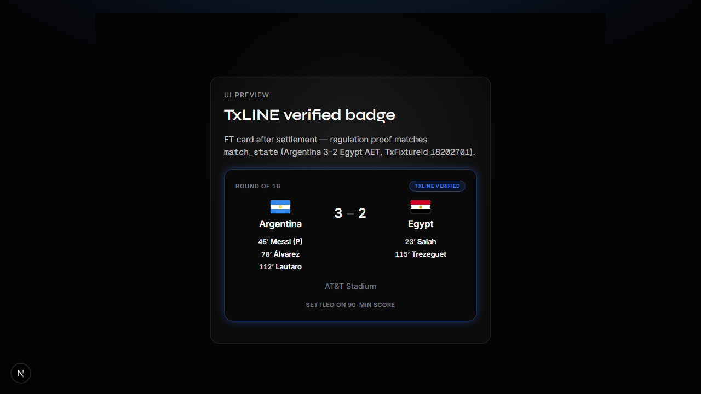

# Copa Mundial


Predict World Cup scorelines on X, earn odds-weighted points, and win USDC on Solana — with TxLINE proofs you can check against Solana.

Copa Mundial is a football score-prediction game. You reply to a match thread on X (Twitter) with your scoreline before kickoff, points are awarded automatically when the match ends, and your score builds up on a season-long leaderboard. Once a day the top players can claim a share of a USDC prize pool paid out on Solana.

The part that makes it different: results aren’t just trusted, they’re provable. Match data comes from TxLINE (by TxODDS), which publishes score proofs anchored on Solana. When a match settles, Copa Mundial stores that proof and only shows a “TxLINE verified” badge when the proof’s regulation score matches the score we settled in the database. Separately, you can run the same proof against the on-chain Merkle root with a CLI script — that chain check is for judges and ops, not something the live card does on every refresh.

**Live:** [copamundial.app](https://copamundial.app)  
**Demo video:** [Watch on YouTube](https://www.youtube.com/watch?v=VF-6Uia6n-0) (~3–4 min)  
**Network:** Solana devnet — rewards are test-USDC, not real money  
**Track:** Superteam × TxODDS — Consumer & Fan Experiences  
**Community:** [Discord](https://discord.gg/BS3q3aMFd)

**Please read:** This is a devnet prototype. It runs end-to-end, but it is not audited and handles no real funds. See [Honesty & security](#honesty--security).



## Live usage (production)

These are real figures from the live app, measured **2026-07-18** against the production Supabase instance (`whuyptdtrwkzxeunouoo.supabase.co`) and the public leaderboard API. Numbers grow as more matches are played.

| Metric | Value |
|--------|------:|
| Predictions stored | 823 |
| Players with scored points | 393 |
| Matches settled via TxLINE | 14 |
| TxLINE proofs stored (`match_proofs`) | 14 (all earned the verified badge) |
| Goal events recorded (`match_goals`) | 60 |
| Payout epochs opened (devnet) | 9 |
| USDC claims logged (`solana_claims`) | 53 |
| Total points awarded | 2789 |

The public leaderboard is served from `GET /api/leaderboard` — **393** ranked players, with a top score of **61** points as of the query date.

Each day at **10:00 UTC** a snapshot locks the top 20 and posts that day’s standings to Discord.

## How it works

1. **Reply before kickoff.** Post your scoreline (e.g. `2-1`) as a reply to the match thread on X. Your first valid reply is the one that counts.
2. **Points are automatic.** When the match finishes, points are awarded based on how accurate you were, and they add to your season total.
3. **Daily snapshot.** Every day at 10:00 UTC a snapshot locks in the top 20, who can then claim a share of the USDC prize pool on Solana.

Free to play — you only need a wallet if you want to collect a payout.

## Scoring formula

Each match gives you points in two parts: an accuracy base and a market multiplier.

**Accuracy base** — you get the single best tier that applies (one score per match):

| Tier | Base points |
|------|------------:|
| Exact scoreline | 5 |
| Correct result (win / draw / loss) | 3 |
| Played (wrong result) | 1 |

**Market multiplier** — rewards you for correctly backing an unlikely result. It uses the locked pre-match 1X2 odds and only applies when your result or exact score was right:

```
multiplier = min(3, 100 / impliedPct)
points     = round(base × multiplier)
```

**Worked example.** You predict an exact scoreline (base 5) for an underdog whose implied win chance was 25%. Multiplier = `min(3, 100 / 25) = 3`. Points = `round(5 × 3) = 15`. Backing a heavy favourite would earn a much smaller multiplier, so beating the odds is always worth more.

Implementation: `lib/scoring.ts`.

## Built on TxLINE (the key integration)

[TxLINE](https://txline.txodds.com/documentation/worldcup) (TxODDS) supplies fixtures, live scores, odds, stat-validation proofs, and score-event replay. It’s used across six surfaces:

| # | Endpoint | Used for |
|---|----------|----------|
| 1 | `GET /api/fixtures/snapshot` | Schedule and kickoff times for the live board |
| 2 | `GET /api/scores/snapshot/{fixtureId}` | Live score, clock, and match status |
| 3 | `GET /api/odds/snapshot/{fixtureId}` | Pre-match odds, locked and used for the scoring multiplier |
| 4 | `GET /api/scores/stat-validation` | Score proofs (Merkle payloads) used to gate the verified badge and for optional on-chain checks |
| 5 | `GET /api/scores/historical/{fixtureId}` | Fills in goal details after a match ends |
| 6 | `GET /api/scores/updates/{fixtureId}` | Real-time updates, including penalty shootouts |

**Auth.** Two things are needed on each request:

1. A guest JWT — `POST /auth/guest/start`, refreshed automatically (`lib/txodds.ts`).
2. An API token — `X-Api-Token` from activation (`txodds/get-txodds-key.mjs` → `TXODDS_API_TOKEN`).

```
Authorization: Bearer <guest jwt>
X-Api-Token:   <activated api token>
```

## Verified results (the standout feature)

After a match settles via TxLINE, a scoring job fetches the stat-validation proofs and stores them in `match_proofs` (`lib/matchProofFetch.ts`). Each row holds two payloads: an official proof at the `game_finalised` event, and a regulation proof at the settlement basis. Copa Mundial scores predictions on the regulation total.

The **TxLINE verified** badge on a full-time card appears only when the regulation proof exactly matches the settled score in `match_state`. Any mismatch hides the badge (`evaluateProofSemantics` in `lib/txScoreProofSemantics.ts`). The live card does not call Solana for that — it is a proof-vs-settled-score check. The system is self-healing: if only a terminal-whistle proof exists at first fetch, the row is upgraded when the finalised proof arrives (within 24 hours).



**Want the on-chain check?** `scripts/verify-proof.ts` fetches both proofs and runs TxOracle `validate_stat` against the devnet `daily_scores_roots` Merkle root (`lib/txlineValidateStat.ts`, IDL in `txodds/txoracle-devnet.json`). That is a CLI path for judges/ops — not part of the fan-facing app at runtime.

## Penalty shootouts

When a knockout goes to penalties, the score snapshot often trims individual kick rows after full time, so Copa Mundial merges three feeds: the snapshot (live tally and final status), updates (kick-by-kick replay with the scorer), and historical (fallback when updates are empty). Parsed kicks persist to `match_penalty_kicks` and render as ○/✗ marks under each side on the fixture card.

UI sandboxes: [`/proof-preview`](https://copamundial.app/mundial/proof-preview) (verified badge) and [`/penalty-preview`](https://copamundial.app/mundial/penalty-preview) (shootout marks).

## How it’s built

- **App:** Next.js (App Router) + TypeScript
- **Data:** TxLINE — fixtures, scores, odds, proofs
- **Database:** Supabase (Postgres) — predictions, `match_odds`, `match_goals`, `match_proofs`, snapshots, payout epochs
- **Sign-in:** NextAuth (X provider)
- **Payouts:** Solana + USDC — signed, single-use claim vouchers on operator-opened epochs
- **Jobs:** Vercel crons for kickoff collection, scoring, the daily snapshot, and fixture sync

## Smart contract

An Anchor program lives in [`solana-program/`](solana-program/). The operator opens each epoch with a USDC pot, the server signs a voucher for each winner, and claim verifies the ed25519 signature and keccak message hash on-chain before any transfer.

**Devnet program ID:** [`2GvW9gBcFmmUcoQDoBVQe9rpR1dGzD4uTdaLzzwRzRz9`](https://explorer.solana.com/address/2GvW9gBcFmmUcoQDoBVQe9rpR1dGzD4uTdaLzzwRzRz9?cluster=devnet) (declared in `solana-program/programs/state/src/lib.rs`)

### On-chain evidence (devnet)

Devnet explorer history does not stick around. Transaction pages often go missing after a few hours, even when the open-epoch and claim really did land. So this README does not pin fixed explorer links.

What stays put:

- The **program** above — that is what opens each epoch and pays out USDC
- The **claim log** in production — **53** confirmed rows in `solana_claims` (same figure as [Live usage](#live-usage-production); refresh anytime with `npx tsx scripts/query-live-usage.ts`)
- A **local replay** if you want a live explorer URL right now:

```bash
npm run demo:epoch -- --pot 2000
npm run e2e:solana-claim -- <epochId>
```

Those commands print fresh signatures when they finish.

## Running it / reproducing the demo

### Local setup

```bash
npm install
cp .env.example .env.local   # fill in your keys
npm run dev
```

`.env.local` needs your X auth, Supabase, `TXODDS_API_TOKEN`, Solana RPC, and signer keys. No secrets are committed.

Refresh the live usage stats above:

```bash
npx tsx scripts/query-live-usage.ts
```

### Judge quickstart

```bash
# Verify a dual Merkle proof + on-chain validity
npx tsx scripts/verify-proof.ts 18202701

# Solana payout loop (devnet only)
npm run demo:epoch -- --pot 2000
npm run e2e:solana-claim -- <epochId>

# Key unit tests
npm run test:ci
```

### Devnet payout demo

Requires `SOLANA_RPC_URL` pointing at devnet, operator/signer keys, and a funded rewards vault.

```bash
npm run demo:epoch -- --pot 2000
npm run e2e:solana-claim -- <epochId>
```

`open:solana-epoch` opens an epoch on-chain manually (positional args, no devnet guard).

Goal and proof maintenance:

```bash
npm run backfill:goals
npm run backfill:proof
npx tsx scripts/verify-proof.ts <txFixtureId>
```

### Database setup

Apply the migrations in filename order on a fresh Supabase project (Dashboard → SQL Editor), starting from `supabase/schema.sql`, then everything under `supabase/migrations/`.

The match-proof migrations can also be applied with `npx tsx scripts/apply-match-proofs-migrations.ts` when `DATABASE_URL` or `SUPABASE_SERVICE_ROLE_KEY` is set. The app and migration scripts require `SUPABASE_SERVICE_ROLE_KEY`.

## Demo video

Watch the walkthrough on YouTube: [https://www.youtube.com/watch?v=VF-6Uia6n-0](https://www.youtube.com/watch?v=VF-6Uia6n-0)

## Honesty & security

- **Devnet only.** It runs on a test network, not mainnet, and the USDC is test-USDC, not real money.
- **Not audited.** An independent security audit is the required next step before any real funds are handled.
- **The browser never writes to the database directly.** All reads go through `/api/…` routes (`Browser → fetch("/api/…") → Next`). Client routes are read-only (`/api/matches`, `/api/leaderboard`, `/api/me/leaderboard-stats`); collection, scoring, snapshots, and claims run server-side with `SUPABASE_SERVICE_ROLE_KEY`.
- **Reward tables are locked down.** They have no anon/authenticated write policies via RLS. See [`docs/SUPABASE_RLS.md`](docs/SUPABASE_RLS.md).
- **Payout vouchers are signed on the server** and can each be claimed only once.

This project was designed and led by the builder, and built hands-on with AI development tools — normal for a project at this stage.

## Next steps

- Independent security audit
- Mainnet deployment and real-money licensing
- More TxLINE data types and match coverage

## License

MIT — see [LICENSE](LICENSE).
